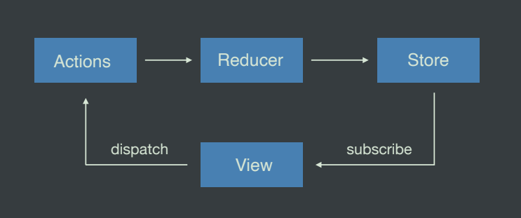
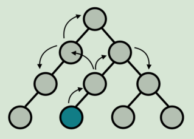
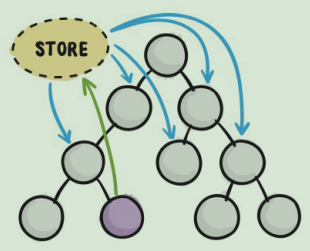
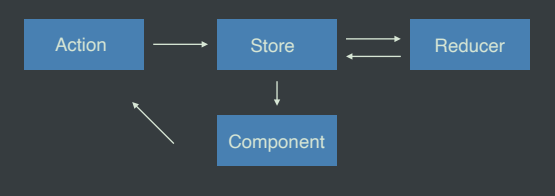

# Redux
[toc]

## Redux核心概念及工作流程


- Store: 存储状态的容器，JavaScript对象
- View: 视图，HTML页面
- Actions: 对象，描述对状态进行怎样的操作
- Reducers: 函数，操作状态并返回新的状态

## Redux核心API
```js
// 创建Store状态容器
const store = Redux.createStore(reducer);
// 创建用于处理状态的reducer函数
function reducer(state = initialState, action) {}
// 获取状态
store.getState();
// 订阅状态
store.subscribe(function(){});
// 触发Action
store.dispatch({type: 'description...'});

```

## React + Redux
### 在React中不使用Redux时遇到的问题

在React组件通信的数据流是单向的，顶层组件可以通过props属性向下层组件传递数据，而下层组件不能向上层组件传递数据，要实现下层组件修改数据，需要上层组件传递修改数据的方法到下层组件，当项目越来越大的时候，组件之间传递数据变得越来越困难



### 在Redux项目中加入Redux的好处
使用Redux管理数据，由于Store独立于组件，使得数据管理独立于组件，解决了组件与组件之间传递数据困难的问题



#### 工作流程
1. 组件通过dispatch方法出发action
2. Store 接收Action并将Action分发给Reducer
3. Reducer根据Action类型对状态进行更改并将更改后的状态返回给Store
4. 组件订阅了Store中的状态， Store中的状态更新会同步到组件
   

   
   